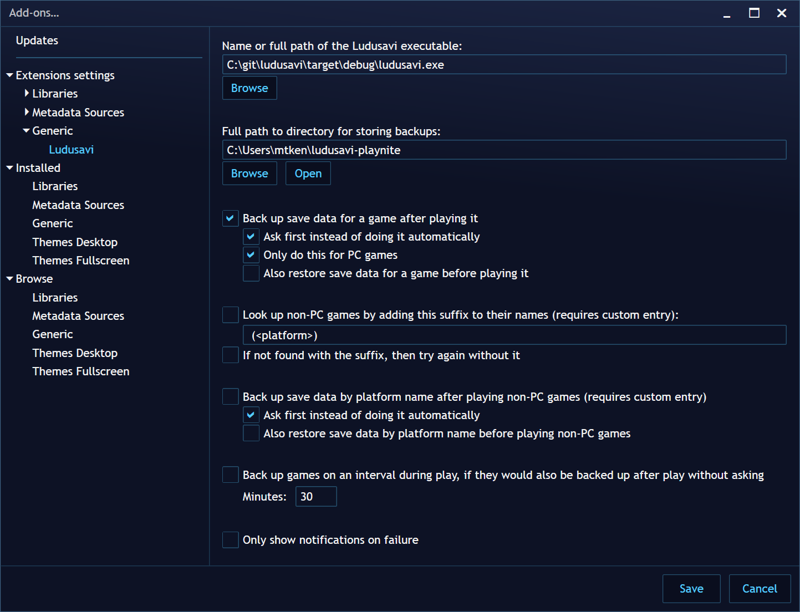

# Ludusavi for Playnite
This project is a [Playnite](https://playnite.link) plugin to
back up your save data using [Ludusavi](https://github.com/mtkennerly/ludusavi).

## Features
* Known save locations for more than 10,000 games.
* On-demand backup and restore for all saves.
* Automatically back up a game when you finish playing it
  and even periodically during play.

The [info on what to back up](https://github.com/mtkennerly/ludusavi-manifest)
is ultimately sourced from [PCGamingWiki](https://www.pcgamingwiki.com/wiki/Home),
so please contribute any new or fixed data back to the wiki itself, and your
improvements will be incorporated into Ludusavi's data as well.

If you'd like to help translate this plugin into other languages,
[check out the Crowdin project](https://crowdin.com/project/ludusavi-playnite).

## Setup
### Ludusavi
Refer to the [Ludusavi project](https://github.com/mtkennerly/ludusavi)
for instructions on how to install Ludusavi itself.
Ludusavi 0.14.0 or newer is recommended for full functionality,
but version 0.7.0 or newer will work (albeit without some features enabled).

By default, the plugin will look for the Ludusavi executable in your `PATH`
environment variable, but you can also configure the plugin with the full
path to the executable.

### Plugin
You can download the plugin from the
[releases page](https://github.com/mtkennerly/ludusavi-playnite/releases).
There are two ways to install it:

* Using the `*.pext` file:
  * Download `ludusavi-playnite-v*.pext`
  * Drag and drop the file into Playnite
* Using the `*.zip` file:
  * Download `ludusavi-playnite-v*.zip`
  * Extract it into a subfolder of the Playnite extensions directory
    (e.g., `C:/Users/<YOUR_NAME>/AppData/Local/Playnite/Extensions/Ludusavi`)

### Configuration
The plugin provides some of its own configuration (see the screenshots below),
but you'll also need to open Ludusavi to configure it as needed. For example,
at this time, the plugin is not able to tell Ludusavi about your Playnite
library sources, so you'll need to configure Ludusavi's roots separately.

Behavior can be overridden for specific games by using tags:

| Tag                                       | Back up after play  | Restore before play | Back up non-PC platform before play | Restore non-PC platform after play |
|-------------------------------------------|---------------------|---------------------|-------------------------------------|------------------------------------|
| `[Ludusavi] Skip`                         | No                  | No                  | No                                  | No                                 |
| `[Ludusavi] Game: backup`                 | Yes, without asking |                     |                                     |                                    |
| `[Ludusavi] Game: backup and restore`     | Yes, without asking | Yes, without asking |                                     |                                    |
| `[Ludusavi] Game: no backup`              | No                  | No                  |                                     |                                    |
| `[Ludusavi] Game: no restore`             |                     | No                  |                                     |                                    |
| `[Ludusavi] Platform: backup`             |                     |                     | Yes, without asking                 |                                    |
| `[Ludusavi] Platform: backup and restore` |                     |                     | Yes, without asking                 | Yes, without asking                |
| `[Ludusavi] Platform: no backup`          |                     |                     | No                                  | No                                 |
| `[Ludusavi] Platform: no restore`         |                     |                     |                                     | No                                 |

For example, if the global backup-after-play option is enabled, but a game is
marked with `[Ludusavi] Skip`, then it will not be backed up after play.
However, the game will still be included when doing a full backup of all games from the menu.

`[Ludusavi] Skip` takes precedence over the other tags,
and the `no` tags take precedence over their positive counterparts.

## Screenshots
### Prompt after exiting a game
> 

### Main menu actions
> 

### Game menu actions
> 

### Notifications
> 

### Settings
> 

## Other notes
* The backup and restore operations run in the background after you start them.
  You'll get a notification in Playnite when they finish. If you try to start
  another operation before the first one finishes, you'll have to wait.
* When processing specific games via the context menu,
  the plugin will try to look them up a few ways, in this order of precedence:

  * Steam ID (if applicable)
  * Title
  * Normalized title (if enabled in the plugin settings)
    * For example, "Some Game: Special Edition (2022)" normalizes to just "Some Game".

  Playnite and Ludusavi don't always use the same name for each game,
  so that's why these fallbacks are needed.
  If a match is found with a different name than in Playnite,
  then the notification will include `Playnite Title (↪ Ludusavi Title)`.
* After doing a full backup/restore of all games, you can click the notification to see the list.
  There, "+" denotes a newly found game, and "Δ" denotes a game whose saves have changed.
* For backups, the plugin always sets Ludusavi's `--merge` flag. This way,
  if you back up saves for one game, it will not interfere with any backups
  you may have for another game.
* Although Ludusavi only knows about PC games by default, you can add custom
  entries in Ludusavi for non-PC games if you'd like. The plugin provides a
  setting to either look up those custom entries by the game's name on its own
  or with a suffix, in case you need multiple custom entries for the same game
  name on different platforms.

  Within the suffix, you can write `<platform>` and it will be replaced by
  the actual platform name. For example, if you enable the default suffix and
  you'd like a custom entry for `Some Game` on Nintendo 64, then in Ludusavi
  you would create a custom entry called `Some Game (Nintendo 64)`.
* If you want a single custom entry for all games on a particular non-PC platform
  (such as when all of the saves for that platform are in a single memory card file),
  you can enable the "back up save data by platform name" setting. You will just need
  to create a custom entry in Ludusavi with the same name as the platform.

## Development
Please refer to [CONTRIBUTING.md](./CONTRIBUTING.md).
